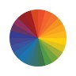

# RGB YouTube Progress Bar

## You can install the extension [here](https://addons.mozilla.org/addon/rgb-youtube-progress-bar/).

Firefox extension that makes the YouTube progress bar of videos and advertisements cycle colors. 
The following video sharing/hosting websites are also supported:

- https://youtube.com/
- https://odysee.com/
- https://vimeo.com/
- https://invidious.snopyta.org/
- https://invidious.xyz/
- https://invidious.kavin.rocks/
- https://tube.connect.cafe/
- https://invidious.zapashcanon.fr/
- https://invidiou.site/
- https://vid.mint.lgbt/
- https://invidious.site/
- https://yewtu.be/
- https://invidious.tube/
- https://invidious.silkky.cloud/
- https://invidious.himiko.cloud/
- https://inv.skyn3t.in/
- https://tube.incognet.io/
- https://invidious.tinfoil-hat.net/
- https://invidious.namazso.eu/
- https://vid.puffyan.us/
- https://dev.viewtube.io/
- https://tube.cthd.icu/
- https://invidious.048596.xyz/

 

The target browser is Firefox but Firefox-based browsers should work as well. The extension has been tested on Brave browser (Chromium-based) and it works (there are warning in the manifest file).

<a href="https://www.vecteezy.com/free-vector/rgb-color-wheel">
    
     
    Rgb Color Wheel Vectors by Vecteezy
</a>
